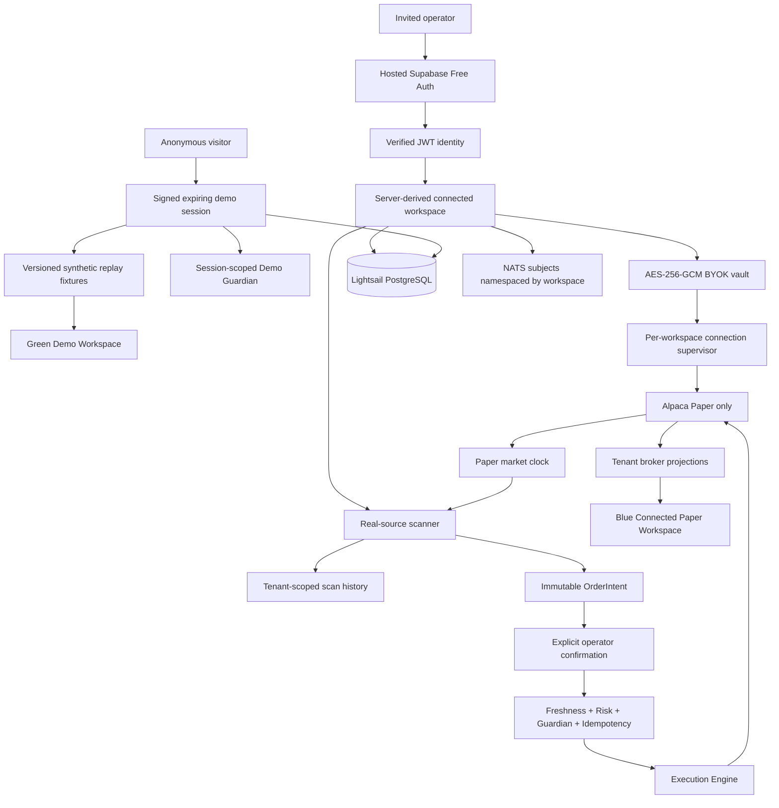

# AlphaDesk dual-workspace architecture

## Security boundaries

- Demo routes cannot construct a broker adapter and never fall back to connected data.
- Connected routes require a valid Supabase JWT. The API derives the workspace from the authenticated subject and never accepts a tenant ID from the browser.
- Operator Alpaca and OpenRouter secrets are write-only, encrypted with unique nonces and tenant-bound associated data, and stored only in AlphaDesk PostgreSQL.
- Supabase's server secret is available only to the API. The worker receives an explicit empty override and the browser receives only public Supabase configuration.
- The worker decrypts a credential only in memory and supervises each workspace independently.
- Manual and scheduled scans create workspace-scoped scan-run records. Opportunity rows retain real-source timestamps and provenance; older ungrouped rows are not assigned fabricated history.
- Only the Execution Engine submits orders. Every paper order requires a fresh explicit confirmation and is reconciled by stable client-order ID.
- PostgreSQL and NATS have no published ports in the Lightsail Compose file. Caddy is the only public ingress.
